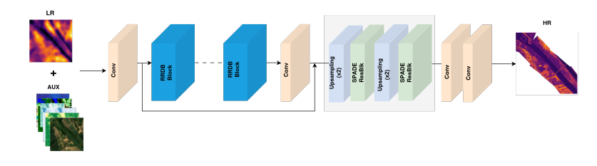
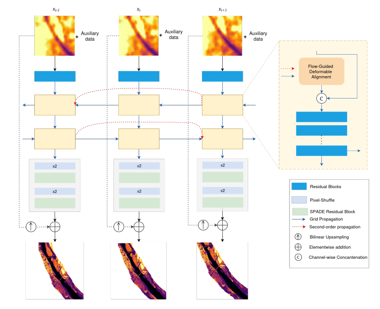
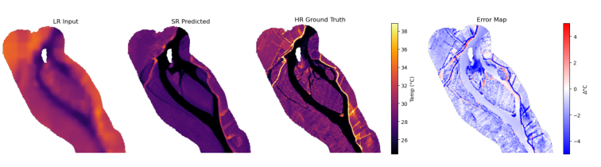

## Super-Resolution of Thermal Infrared Imagery

> Note: 
For the detailed content of the data processing and model pipelines, see the [master's thesis](https://ethel-ogallo.github.io/portfolio/projects.html).

This repository contains scripts to train and evaluate SR models on TIR river data. First benchmarking of SOTA models (EDSR, SwinIR, HAT and Real-ESRGAN), second an auxiliary guided SISR model (modified Real-ESRGAN) and finally a guided sequential SR model (BasicVSR++). The models are trained on airborne TIR imagery (7.5m res) acquired over the Rhône River, with corresponding Landsat imagery (30m res).


### Repository Structure

```text
Superresolution-TIR/
│
├── SISR/                         # Single-image super-resolution
│   ├── bash/                     # Training and hyperparameter-tuning scripts
│   ├── configs/                  # Model and experiment configurations
│   ├── notebooks/                # Exploration, benchmarking and analysis
│   └── scripts/
│       ├── evaluation/           # Evaluation and metric calculation
│       ├── models/               # Model definitions and adaptations
│       ├── preprocess/           # Data preprocessing
│       ├── training/             # Training code
│       └── utils/                # Supporting utilities
│
├── Seq_SR/                       # Sequential super-resolution
│   ├── bash/
│   ├── configs/
│   ├── notebooks/
│   └── scripts/
│
├── requirements.txt              # Python dependencies
└── README.md
```
### Guided SR
  

### Sequential SR



### Results
Sample output 


### Acknowledgements

This work was carried out as part of the Copernicus Master in Digital Earth Master's programme.


